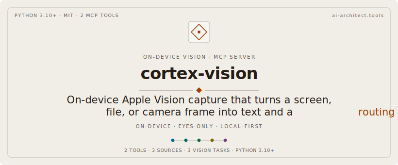

# cortex-vision

<p align="center"></p>

On-device **vision capture MCP for Cortex** (macOS). Point it at the screen, an
image file, or your camera; it grabs one image, runs an on-device Apple Vision
task (OCR, scene labels, or barcodes), decides whether the extracted text reads
as a question or a fact, and hands back the result plus a routing hint. It is
**eyes-only** — it never reads or writes memories itself. The caller chains to
the **Cortex MCP** `recall`/`remember` tools.

```
Claude → look(source="screen", task="ocr")    # cortex-vision captures + reads text
  ← { text, intent: "remember", suggested_tags: [...], next_action }
Claude → cortex remember(content=text, tags=[...,"vision"])   # Cortex MCP
```

## Why eyes-only

Cortex owns the memory pipeline (embeddings, heat, predictive-coding write gate,
WRRF retrieval). Re-implementing any of that here would duplicate and inevitably
diverge from the single source of truth. So cortex-vision does exactly one thing —
turn an image into text/labels/barcodes + an intent — and lets Cortex's own
tools do the memory work. Vision = eyes, Cortex = memory, Claude = orchestrator.

## Tools

| Tool | Purpose |
|---|---|
| `check_vision_setup()` | Compile the native helper and report Camera + Screen Recording authorization. **Call once before first use** to trigger the macOS Camera prompt. |
| `look(source=None, task=None, mode="auto", path=None, region=None, max_results=50)` | Grab one image and run a vision task. Returns `{text, labels, barcodes, intent, suggested_tags, duration_s, on_device, next_action}`. |

- `source`: `screen` (ScreenCaptureKit / `screencapture -x`), `file` (needs `path`), or `camera` (AVFoundation frame grab).
- `task`: `ocr` (recognize text), `scene` (classify/label), or `barcode` (barcodes/QR).
- `mode`: `auto` (classify recall vs remember), `recall`, or `remember`.
- `region`: optional `x,y,w,h` crop for screen capture.

## How it works

- A small Swift helper (`scripts/viscap.swift`) acquires the image
  (`screencapture` for screen, `CGImageSource` for files, `AVCaptureSession`
  for the camera) and runs the Vision request (`VNRecognizeTextRequest`,
  `VNClassifyImageRequest`, or `VNDetectBarcodesRequest`), all on-device. It
  emits one JSON line.
- The helper is **compiled lazily** with `swiftc` on first use into the
  plugin's persistent `deps/bin/` dir, carrying an embedded `Info.plist` so the
  macOS Camera prompt reads sensibly. Compilation is deferred so the MCP
  handshake stays instant (no startup-timeout risk).
- The Python FastMCP server (`cortex_vision/`) subprocesses the helper off the
  event loop, classifies intent deterministically (`vision/intent.py`), and
  returns the structured result.

## Requirements

- **macOS** (Apple Vision framework) with the Xcode command-line tools / Swift
  toolchain (`swiftc`).
- **Camera** permission (for `source="camera"`) granted to the controlling app
  (your terminal or the Claude app) in *System Settings → Privacy & Security →
  Camera*.
- **Screen Recording** permission (for `source="screen"`) — this **cannot be
  auto-granted**; enable it manually in *System Settings → Privacy & Security →
  Screen Recording*, then restart the controlling app.

## Configuration

`userConfig` in `plugin.json`: `default_source` (default `screen`),
`default_task` (default `ocr`), and `default_mode` (default `auto`). These map
to the `VISION_DEFAULT_SOURCE` / `VISION_DEFAULT_TASK` / `VISION_DEFAULT_MODE`
env vars the server reads.

## License

MIT.
